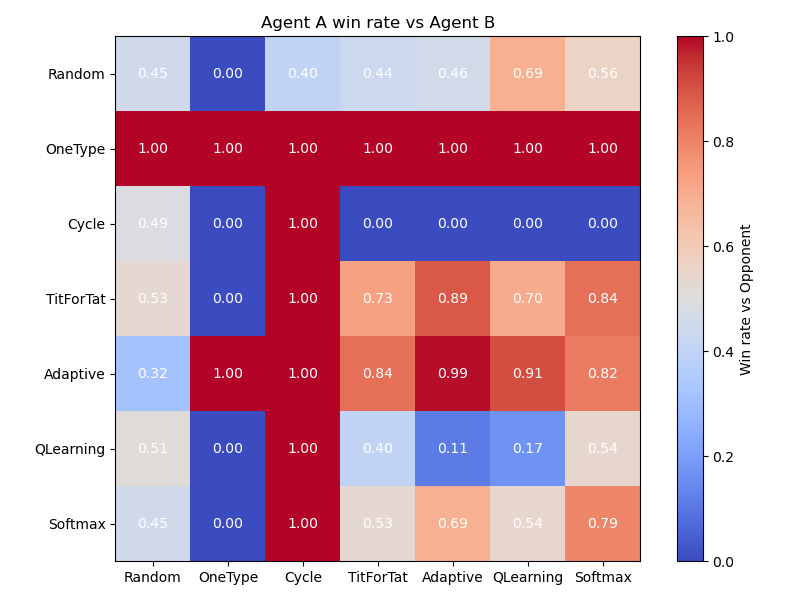

## Rock-Paper-Scissors-Lizard-Spock — Reinforcement Learning Arena

_Version 0.2.1_

A reinforcement learning playground for multi-agent training, strategy visualization, and interactive gameplay in the expanded RPSLS universe.

## What is RPSLS?
An extension of classic Rock-Paper-Scissors, the RPSLS game introduces two new elements — Lizard and Spock — creating a richer and more strategic 5-action environment. This project simulates and analyzes RPSLS using reinforcement learning and heuristic agents. 

Here's how the game works
- **Rock** crushes **Scissors** and crushes **Lizard** 
- **Paper** covers **Rock** and disproves **Spock** 
- **Scissors** cuts **Paper** and decapitates **Lizard** 
- **Lizard** eats **Paper** and poisons **Spock** 
- **Spock** smashes **Scissors** and vaporizes **Rock** 

## Features
- **Trainable Agents and Heuristic Agents** — Supports Q-Learning, Softmax, Adaptive, Tit-for-Tat, and more
- **Weighted & Custom Payoff Tables** — Experiment with biased payoff game
- **Training Visualization** — Tracks Q-value convergence and policy evolution
- **Interactive Streamlit App** — Let humans play against AI, or watch AI vs. AI battles live
- **Modular Design** — Easily extend with new environments, agent classes, or reward structures

## Project Structure
```
rpsls/
├── agents/             # Reinforcement learning & heuristic agents
├── app_tools/          # Utility functions for streamlit web app
├── app.py              # Entry point for streamlit web app
├── config.py           # Configurations for training and agent setup
├── env/                # RPSLS environment logic and reward structure
├── rewards_tables/     # Classic and custom payoff definitions
├── saved_Q_table/      # Pretrained Q-tables for interactive use
├── streamlit/          # Streamlit web app for interactive play
├── training/           # Agents training functions
├── tools/              # Utility functions (e.g. heatmaps, plotting)
└── main_train.py       # Entry point for training agents
```

## Streamlit
You can play directly against the AI or watch agent-vs-agent matches in your browser.
```bash
streamlit run app.py
```
### Features
- Choose your opponent (QLearning, Softmax, Random...)
- Select different reward tables
- Track your score and match history
- See how AI evolves over rounds
- Watch agent vs. agent simulations

## Agents Implemented
| Agent            | Type      | Description                         |
| ---------------- | --------- | ----------------------------------- |
| `RandomAgent`    | Heuristic | Picks actions uniformly at random   |
| `OneTypeAgent`   | Heuristic | Always plays the same move          |
| `CycleAgent`     | Heuristic | Cycles through available actions    |
| `TitForTatAgent` | Heuristic | Beats the opponent's previous move |
| `AdaptiveAgent`  | Heuristic | Exploit startegy over Nash strategy | 
| `QLearningAgent` | RL        | Learns via Q-learning               |
| `SoftmaxAgent`   | RL        | Uses softmax sampling over Q-values |

## Training
You can train agents via
```bash
python main_train.py --table CLASSIC_RPSLS
```
Visual outputs (Q-value-convergence, strategy-distribution, agents-winrate-heatmap) and will be saved under `images/`. <br/>
Q-value tables will be saved under `saved_Q_tables/`.

## Previews
Here are some win rate heatmaps. Since random selection is involved and exploration differs in each training episode, the heatmaps may vary every time.

- **CLASSIC_RPSLS**
<div style="text-align: center;">
    
</div>

- **WEIGHTED_RPSLS**
<div style="text-align: center;">
    
</div>

- **ONLY_SPOCK**
<div style="text-align: center;">
    
</div>

## Future Developments
- **Improved State Representation**: Move history, opponent distributions, score gap.
- **Flexible Payoff Matrices**: Support asymmetric and dynamic payoff structures, including row-based and context-aware rewards.
- **Advanced Agents**: Implement opponent modeling, policy gradients, and meta-learning strategies.
- **UI Improvements**: Enable tooltips for payoff tables, live Q-table visualization, and agent uploads.

## Contributing

_Suggestions, PRs, and collaboration are very welcome!_

Contact: tim.pjchen@email.com

## License

Licensed under the MIT License. See the [LICENSE](LICENSE) file for details.

## Reference

If you use this package for research or teaching, please cite:
Peng-Jen Chen, https://github.com/Peng-Jen/RPSLS-Reinforcement-Learning, 2025
